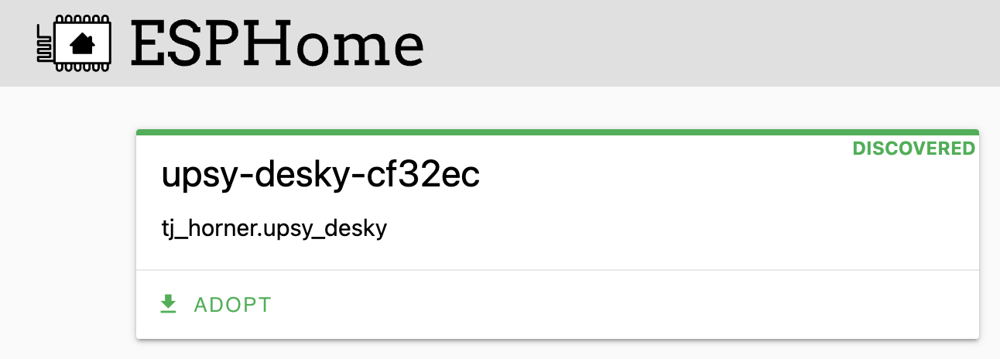

# Firmware Customization

Since the Upsy Desky's firmware is based on [ESPHome](https://esphome.io), making customizations to the firmware is as easy as editing some YAML. The best way to modify the firmware config is by installing the [ESPHome Dashboard](https://esphome.io/guides/getting_started_hassio.html) (or using it [via cli](https://esphome.io/guides/getting_started_command_line.html)).

## Adopting the Device

Once ESPHome Dashboard is running, and your Upsy Desky is [connected to your network](../../getting-started.mdx), it should prompt you to adopt it.



Go through the adoption flow; it will do these things:

1. Create an ESPHome configuration file
2. Set an API encryption key (used by Home Assistant or other native API consumers)
3. Bake the Wi-Fi credentials into the firmware
4. Install the new firmware to the device

## Modifying the Configuration

Once ESPHome Dashboard is finished adopting the device, you will see a new node for your Upsy Desky by the name of `upsy-desky-XXXXXX`, where `XXXXXX` is derived from the MAC address of the device. Click on the edit button to see the config file.

It should look something like the following:

```yaml
substitutions:
  name: upsy-desky-cf32ec
packages:
  # Change the line below to reference `base.yaml` instead, if you want the
  # base config (see next section for details)
  tj_horner.upsy_desky: github://tjhorner/upsy-desky/firmware/stock.yaml@v0.3.1
esphome:
  name: ${name}
  name_add_mac_suffix: false
api:
  encryption:
    key: your-encryption-key

wifi:
  ssid: !secret wifi_ssid
  password: !secret wifi_password
```

It is pretty barebones, but this is because it references the [stock firmware config](https://github.com/tjhorner/upsy-desky/blob/master/firmware/stock.yaml) as a package, which contains all the components necessary for it to work. You can add other components to the config as you wish; for example, you might want to turn your Upsy Desky into a [Bluetooth proxy](https://esphome.io/components/bluetooth_proxy.html) in order to extend Home Assistant's Bluetooth range.

There are also some substitutions you can declare which will change the behavior in the firmware, most notably is `friendly_name`, which changes the "friendly name" in each of the sensors. (See also: [Renaming the Device](../../configuration/renaming/index.md))

### Trimming the Firmware

When Upsy Desky units are shipped out, they are flashed with an ESPHome config that contains the [base config](https://github.com/tjhorner/upsy-desky/blob/master/firmware/base.yaml) (with all the components for height decoding, presets, etc.) as well as some components which are helpful for users that do not use ESPHome or Home Assistant, as well as some components to improve the out of box experience (e.g., captive portal, Improv serial, etc.).

This is also the config that ESPHome Dashboard will adopt the device with, in order to minimize friction when initially adopting the device. However, there are likely components in there that you do not need. Switching to the base config will significantly reduce the firmware size &mdash; by about 66% &mdash; and removes some components that may be insecure.

You can review the stock firmware config [here](https://github.com/tjhorner/upsy-desky/blob/master/firmware/stock.yaml) and determine if you are using any components from that config. If you aren't, you can switch to the base config easily: just change the reference from `stock.yaml` to `base.yaml`.

But if you are using a feature from the stock config and it is not in the base config, you will need to add it to your config manually by copy-pasting the section from `stock.yaml`. For example, if you want to use the base config, but still retain the `web_server` component, your config would look something like this:

```yaml
substitutions:
  name: upsy-desky-cf32ec
packages:
  tj_horner.upsy_desky: github://tjhorner/upsy-desky/firmware/base.yaml@v0.3.1
esphome:
  name: ${name}
  name_add_mac_suffix: false
api:
  encryption:
    key: your-encryption-key

wifi:
  ssid: !secret wifi_ssid
  password: !secret wifi_password

# Copied from stock.yaml: https://github.com/tjhorner/upsy-desky/blob/b238eb40c3203c3af9be2d2b0f8bde571941091e/firmware/stock.yaml#LL19-L20C11
web_server:
  port: 80
```

### Updating Base Config

When you first adopt the device, the package reference is locked to a specific version of the config so as not to cause breaking changes. You can either set this to `master` in order to always get the latest config, or to a specific version tag (see all the releases [here](https://github.com/tjhorner/upsy-desky/releases)).

## Understanding the Configuration

### Addons

To keep things maintainable, each large part of the configuration is broken up into its own "addon". There are currently three addons, all of which are included in the base config:

- `presets.yaml`: Configuration necessary for recalling and setting desk presets
- `runtime-config.yaml`: Entities related to configuration of the device at runtime
- `stable-ids.yaml`: Provides stable IDs for the web API

You can see the source for all the addons [here](https://github.com/tjhorner/upsy-desky/tree/master/firmware/addons).