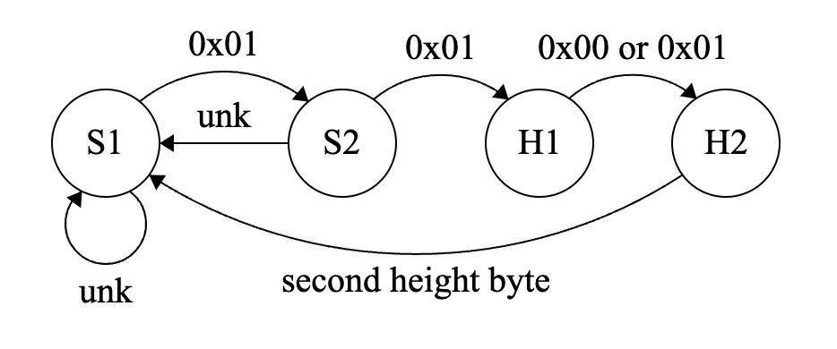

# Reverse Engineering Guide

If your desk is not officially supported, or if you are having issues with functionality like getting or setting desk height, presets, etc. and have followed the [Troubleshooting](../../troubleshooting.md) steps, then it is very possible that your desk uses a protocol that the firmware does not yet understand.

The protocols for standing desk control boxes are not usually published by their manufacturer, so we have to reverse engineer the communication between the keypad and control box as a man in the middle. Luckily, the hardware for the Upsy Desky is well-suited for this, since we have GPIO on both the RX and TX lines for the control box. No additional debugging hardware required!

This guide will go over the basic steps required in order to first capture the messages between the control box and keypad, then analyze them to create a decoder implementation (this is the component which provides the current height) in the ESPHome component that powers the firmware. I will use the Uplift v2 as an example throughout the guide, since that's the standing desk I have.

## Capturing Messages

### Flashing Firmware

Most standing desks communicate with UART, so I've compiled a special firmware with all the necessary ESPHome components to log all the RX/TX messages to the console for further analysis. The ESPHome config file roughly looks like this:

```yaml
logger:
  level: DEBUG

# UART logging is from the perspective of the handset, i.e.:
# - TX is the data sent from the handset to the control box
# - RX is the data sent from the control box to the handset
uart:
  - # Direction: Handset -> Control Box
    id: handset_tx
    baud_rate: 9600
    rx_pin: 17
    debug: &uart_debug
      direction: RX
      dummy_receiver: true
      after:
        timeout: 50ms
      sequence:
        - lambda: UARTDebug::log_hex(uart::UART_DIRECTION_TX, bytes, ':');
  - # Direction: Control Box -> Handset
    id: handset_rx
    baud_rate: 9600
    rx_pin: 16
    debug:
      <<: *uart_debug
      sequence:
        - lambda: UARTDebug::log_hex(uart::UART_DIRECTION_RX, bytes, ':');

# Other supporting components omitted for brevity
```

### Generating Captures

Now that we have a way to capture UART messages between the two devices, we need to perform actions that send the messages we want to analyze. Basically, you'll need to press the buttons on your keypad corresponding to the action you want to intercept or perform. Since we are building a decoder, we will want to analyze the messages from the control box which informs the keypad of the current height.

Once you have the Upsy Desky connected to both the control box and keypad, you will want to go to its web page by visiting the IP (or by viewing the ESPHome logs through the dashboard or CLI). Then raise your desk to its maximum height, then lower to the minimum height. This will give us a comprehensive capture of what the structure of the packet looks like, and what the range of heights can be.

On my Uplift v2 desk, here is what part of my ESPHome log looks like:

```log
20:55:45 | [D] | [uart_debug:114] | >>> 81:F5:01:01:01:44:01:01:01:44:01:01:01:44:01:01:01:44:01:01:01:44:01:01:01:44:01:01:01:44:01:01:01:44:01:01:01:44:01:01:01:44:01:01:01:44:01:01:01:44:01:01:01:44:01:01:01:44:01:01:01:44:01:01:01:44:01:01:01:44:01:01:01:45:01:01:01:45:01:01:01:45:01:01:01:45:01:01:01:45:01:01:01:45:01:01:01:46:01:01:01:46:01:01:01:46:01:01:01:47:01:01:01:47:01:01:01:47:01:01:01:47:01:01:01:47:01:01:01:48:01:01:01:48:01:01:01:48:01:01:01:49:01:01:01:49:01:01:01:49
20:55:46 | [D] | [uart_debug:114] | >>> 01:01:01:49:01:01:01:4A:01:01:01:4A:01:01:01:4A:01:01:01:4B:01:01:01:4B:01:01:01:4B:01:01:01:4B:01:01:01:4B:01:01:01:4C:01:01:01:4C:01:01:01:4D:01:01:01:4D:01:01:01:4D:01:01:01:4D:01:01:01:4E:01:01:01:4E:01:01:01:4E:01:01:01:4F:01:01:01:4F:01:01:01:4F:01:01:01:4F:01:01:01:50:01:01:01:50:01:01:01:50:01:01:01:51:01:01:01:51:01:01:01:51:01:01:01:51:01:01:01:51:01:01:01:52:01:01:01:52:01:01:01:52:01:01:01:52:01:01:01:52:01:01:01:53:01:01:01:53:01:01
20:55:46 | [D] | [uart_debug:114] | >>> 01:53:01:01:01:53:01:01:01:53:01:01:01:53:01:01:01:53:01:01:01:53:01:01:01:53:01:01:01:53:01:01:01:53:01:01:01:53:01:01:01:53:01:01:01:53:01:01:01:53:01:01:01:53:01:01:01:53:01:01:01:53:01:01:01:53:01:01:01:53:01:01:01:53:01:01:01:53:01:01:01:53:01:01:01:53:01:01:01:53:01:01:01:53:01:01:01:53:01:01:01:53:01:01:01:53:01:01:01:53:01:01:01:53:01:01:01:53:01:01:01:53:01:01:01:53:01:01:01:53:01:01:01:53:01:01:01:53:01:01:01:53:01:01:01:53:01:01:01:53
20:55:47 | [D] | [uart_debug:114] | >>> 01:01:01:53:01:01:01:53:01:01:01:53:01:01:01:53:01:01:01:53:01:01:01:53:01:01:01:53:01:01:01:53:01:01:01:53:01:01:01:53:01:01:01:53:01:01:01:53:01:01:01:53:01:01:01:53:01:01:01:53:01:01:01:53:01:01:01:53:01:01:01:53:01:01:01:53:01:01:01:53:01:01:01:53:01:01:01:53:01:01:01:53:01:01:01:53:01:01:01:53:01:01:01:53:01:01:01:53:01:01:01:53:01:01:01:53:01:01:01:53:01:01:01:53:01:01:01:53:01:01:01:53:01:01:01:53:01:01:01:53:01:01:01:53:01:01:01:53:01:01
20:55:48 | [D] | [uart_debug:114] | >>> 01:53:01:01:01:53:01:01:01:53:01:01:01:53:01:01:01:53:01:01:01:53:01:01:01:53:01:01:01:53:01:01:01:53:01:01:01:53:01:01:01:53:01:01:01:53:01:01:01:53:01:01:01:53:01:01:01:53:01:01:01:53:01:01:01:53:01:01:01:53:01:01:01:53:01:01:01:53:01:01:01:53:01:01:01:53:01:01:01:53:01:01:01:53:01:01:01:53:01:01:01:53:01:01:01:53:01:01:01:53:01:01:01:53:01:01:01:53:01:01:01:53:01:01:01:53:01:01:01:53:01:01:01:53:01:01:01:53:01:01:01:53:01:01:01:53:01:01:01:53
20:55:48 | [D] | [uart_debug:114] | >>> 01:01:01:53:01:01:01:53:01:01:01:53:01:01:01:53:01:01:01:53:01:01:01:53:01:01:01:53:01:01:01:53:01:01:01:53:01:01:01:53:01:01:01:53:01:01:01:53:01:01:01:53:01:01:01:53:01:01:01:53:01:01:01:53:01:01:01:53:01:01:01:53:01:01:01:53:01:01:01:53:01:01:01:53:01:01:01:53:01:01:01:53:01:01:01:53:01:01:01:53:01:01:01:53:01:01:01:53:01:01:01:53:01:01:01:53:01:01:01:53:01:01:01:53:01:01:01:53:01:01:01:53:01:01:01:53:01:01:01:53:01:01:01:53:01:01:01:53:01:01
20:55:49 | [D] | [uart_debug:114] | >>> 01:53:01:01:01:53:01:01:01:53:01:01:01:53:01:01:01:53:01:01:01:53:01:01:01:53:01:01:01:53:01:01:01:53:01:01:01:53:01:01:01:53:01:01:01:53:01:01:01:53:01:01:01:53:01:01:01:53:01:01:01:53:01:01:01:53:01:01:01:53:01:01:01:53:01:01:01:53:01:01:01:53:01:01:01:53:01:01:01:53:01:01:01:53:01:01:01:53:01:01:01:53:01:01:01:53:01:01:01:53:01:01:01:53:01:01:01:53:01:01:01:53:01:01:01:53:01:01:01:53:01:01:01:53:01:01:01:53:01:01:01:53:01:01:01:53:01:01:01:53
20:55:50 | [D] | [uart_debug:114] | >>> 01:01:01:53:01:01:01:53:01:01:01:53:01:01:01:53:01:01:01:53:01:01:01:53:01:01:01:53:01:01:01:53:01:01:01:53:01:01:01:53:01:01:01:53:01:01:01:53:01:01:01:53:01:01:01:53:01:01:01:53:01:01:01:53:01:01:01:53:01:01:01:53:01:01:01:53:01:01:01:53:01:01:01:53:01:01:01:53:01:01:01:53:01:01:01:53:01:01:01:53:01:01:01:53:01:01:01:53:01:01:01:53:01:01:01:53:01:01:01:53:01:01:01:53:01:01:01:53:01:01:01:53:01:01:01:53:01:01:01:53:01:01:01:53:01:01:01:53:01:01
20:55:51 | [D] | [uart_debug:114] | >>> 01:53:01:01:01:53:01:01:01:53:01:01:01:53:01:01:01:53:01:01:01:53:01:01:01:53:01:01:01:53:01:01:01:53:01:01:01:53:01:01:01:53:01:01:01:53:01:01:01:53:01:01:01:53:01:01:01:53:01:01:01:53:01:01:01:53:01:01:01:53:01:01:01:53:01:01:01:53:01:01:01:53:01:01:01:53:01:01:01:53:01:01:01:53:01:01:01:53:01:01:01:53:01:01:01:53:01:01:01:53:01:01:01:53:01:01:01:53:01:01:01:53:01:01:01:53:01:01:01:53:01:01:01:53:01:01:01:53:01:01:01:53:01:01:01:53:01:01:01:53
20:55:51 | [D] | [uart_debug:114] | >>> 01:01:01:53:01:01:01:53:01:01:01:53:01:01:01:53:01:01:01:53:01:01:01:53:01:01:01:53:01:01:01:53:01:01:01:53:01:01:01:53:01:01:01:53:01:01:01:53:01:01:01:53:01:01:01:53:01:01:01:53:01:01:01:53:01:01:01:53:01:01:01:53:01:01:01:53:01:01:01:53:01:01:01:53:01:01:01:53:01:01:01:53:01:01:01:53:01:01:01:53:01:01:01:53:01:01:01:53:01:01:01:53:01:01:01:53:01:01:01:53:01:01:01:53:01:01:01:53:01:01:01:53:01:01:01:53:01:01:01:53:01:01:01:53:01:01:01:53:01:01
20:55:52 | [D] | [uart_debug:114] | >>> 01:53:01:01:01:53:01:01:01:53:01:01:01:53:01:01:01:53:01:01:01:53:01:01:01:53:01:01:01:53:01:01:01:53:01:01:01:53:01:01:01:53:01:01:01:53:01:01:01:53:01:01:01:53:01:01:01:53:01:01:01:53:01:01:01:53:01:01:01:53:01:01:01:53:01:01:01:53:01:01:01:53:01:01:01:53:01:01:01:53:01:01:01:53:01:01:01:53:01:01:01:53:01:01:01:53:01:01:01:53:01:01:01:53:01:01:01:53:01:01:01:53:01:01:01:53:01:01:01:53:01:01:01:53:01:01:01:53:01:01:01:53:01:01:01:53:01:01:01:53
20:55:53 | [D] | [uart_debug:114] | >>> 01:01:01:53:01:01:01:53:01:01:01:53:01:01:01:53:01:01:01:53:01:01:01:53:01:01:01:53:01:01:01:53:01:01:01:53:01:01:01:53:01:01:01:53:01:01:01:53:01:01:01:53:01:01:01:53:01:01:01:53:01:01:01:53:01:01:01:53:01:01:01:53:01:01:01:53:01:01:01:53:01:01:01:53:01:01:01:53:01:01:01:53:01:01:01:53:01:01:01:53:01:01:01:53:01:01:01:53:01:01:01:53:01:01:01:53:01:01:01:53:01:01:01:53:01:01:01:53:01:01:01:53:01:01:01:53:01:01:01:53:01:01:01:53:01:01:01:53:01:01
20:55:53 | [D] | [uart_debug:114] | >>> 01:53:01:01:01:53:01:01:01:53:01:01:01:53:01:01:01:53:01:01:01:53:01:01:01:53:01:01:01:53:01:01:01:53:01:01:01:53:01:01:01:53:01:01:01:53:01:01:01:53:01:01:01:53:01:01:01:53:01:01:01:53:01:01:01:53:01:01:01:53:01:01:01:53:01:01:01:53:01:01:01:53:01:01:01:53:01:01:01:53:01:01:01:53:01:01:01:53:01:01:01:53:01:01:01:53:01:01:01:53:01:01:01:53:01:01:01:53:01:01:01:53:01:01:01:53:01:01:01:53:01:01:01:53:01:01:01:53:01:01:01:53:01:01:01:53:01:01:01:53
20:55:54 | [D] | [uart_debug:114] | >>> 01:01:01:53:01:01:01:53:01:01:01:53:01:01:01:53:01:01:01:53:01:01:01:53:01:01:01:53:01:01:01:53:01:01:01:53:01:01:01:53:01:01:01:53:01:01:01:53:01:01:01:53:01:01:01:53:01:01:01:53:01:01:01:53:01:01:01:53:01:01:01:53:01:01:01:53:01:01:01:53:01:01:01:53:01:01:01:53:01:01:01:53:01:01:01:53:01:01:01:53:01:01:01:53:01:01:01:53:01:01:01:53:01:01:01:53:01:01:01:53:01:01:01:53:01:01:01:53:01:01:01:53:01:01:01:53:01:01:01:53:01:01:01:53:01:01:01:53:01:01
20:55:55 | [D] | [uart_debug:114] | >>> 01:53:01:01:01:53:01:01:01:53:01:01:01:53:01:01:01:53:01:01:01:53:01:01:01:53:01:01:01:53:01:01:01:53:01:01:01:53:01:01:01:53:01:01:01:53:01:01:01:53:01:01:01:53:01:01:01:53:01:01:01:53:01:01:01:53:01:01:01:53:01:01:01:53:01:01:01:53:01:01:01:53:01:01:01:53:01:01:01:53:01:01:01:53:01:01:01:53:01:01:01:53:01:01:01:53:01:01:01:53:01:01:01:53:01:01:01:53:01:01:01:53:01:01:01:53:01:01:01:53:01:01:01:53:01:01:01:53:01:01:01:53:01:01:01:53:01:01:01:53
20:55:55 | [D] | [uart_debug:114] | >>> 01:01:01:53:01:01:01:53:01:01:01:53:01:01:01:53:01:01:01:53:01:01:01:53:01:01:01:53:01:01:01:53:01:01:01:53:01:01:01:53:01:01:01:53:01:01:01:53:01:01:01:53:01:01:01:53:01:01:01:53:01:01:01:53:01:01:01:53:01:01:01:53:01:01:01:53:01:01:01:53:01:01:01:53:01:01:01:53:01:01:01:53:01:01:01:53:01:05
```

For this capture, I raised my desk from 32.4 inches to 33.9 inches.

## Analyzing Messages

Your capture may just look like a bunch of random hex numbers, but look close enough and we can see a pattern forming: the messages usually start and end the same way. We can group a sample of the packets based on this pattern and begin to determine the basic structure. You will mostly have to use your intuition to determine the format of the messages.

Here is a sample of messages that I have organized based on this method:

```log
01:01:01:44
01:01:01:45
01:01:01:46
... some more messages
01:01:01:53
```

From this we can determine that my desk's control box sends the height data in a set of four bytes, repeating until the display on the keypad goes inactive after a timeout of around 10 seconds.

Next, let's try to determine what each byte means, and where we can find the height in this message. If you've ever used an old video game trainer or Cheat Engine, then you should find yourself familiar with this process 😄

Let's try to find the height first. If we can reliably determine how the height is represented in each packet, we don't necessarily need to know what the other bytes mean and ignore them. The bytes we're looking for are rapidly changing from packet to packet, as well as either incrementing or decrementing in a near-linear fashion, since during our capture we were either lowering or raising the desk.

If we take a look at the first message and last message in my Uplift v2 capture, we can determine that the third and fourth bytes represent the current height of the desk in the configured units (in my case, inches). In the beginning of the capture, these two bytes were `01:44`, and at the end they were `01:53`. If we turn these two bytes into a 16-bit number (`0x144` and `0x153`) we get `324` and `339` respectively. Success! We've determined which parts of the message represent the height, and all we need to do is divide by 10 to get the resulting height.

Since the first two bytes always appear to be the same, we can use those in our decoder to make sure we are actually about to receive the height message.

## Implementing Decoder

Using all the information we collected, we can create a simple state machine which represents the how we will decode the messages from the control box. We can create a state for each byte we expect in the four-byte message. In the actual implementation, these are named as follows:

- `SYNC1`
- `SYNC2`
- `HEIGHT1`
- `HEIGHT2`

As we receive each byte, we can determine the next state based on the byte that was received, and store the height when we encounter it. Here is a very amateurish FSM diagram representing our state machine:



And here is the actual implementation that this state machine represents:

```cpp
bool UpliftDecoder::put(uint8_t b) {
  switch (state_) {
  case SYNC1:
    if (b == 0x01) {
      state_ = SYNC2;
      return false;
    } else {
      state_ = SYNC1;
      return false;
    }
  case SYNC2:
    if (b == 0x01) {
      state_ = HEIGHT1;
      return false;
    } else {
      state_ = SYNC1;
      return false;
    }
  case HEIGHT1:
    if (b == 0x00 || b == 0x01) {
      buf_[0] = b;
      state_ = HEIGHT2;
      return false;
    } else {
      state_ = SYNC1;
      return false;
    }
  case HEIGHT2:
    buf_[1] = b;
    state_ = SYNC1;
    return true;
  default:
    return false;
  }
  return false;
}
```

Using this method, you should be able to write a decoder for your desk's protocol. You can reference the source code for the existing decoders in [this repo](https://github.com/tjhorner/esphome-standing-desk/tree/master/components/standing_desk_height), which you may find helpful.