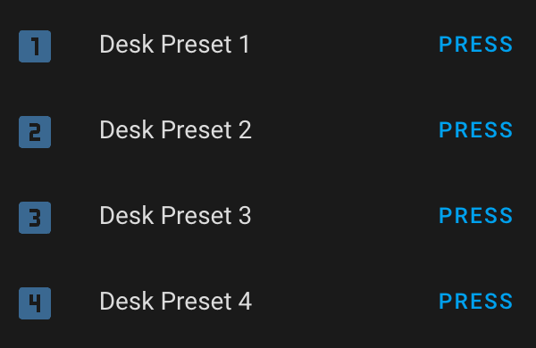

# Presets

Most standing desk control boxes have the ability to store presets — usually up to 4. The Upsy Desky exposes the ability to set and recall these presets through virtual buttons.

Presets are the recommended way to control your desk through the Upsy Desky (as opposed to the Target Desk Height control) since the desk will soft-stop when it nears the preset height, which is not possible through other means.

## Recalling Presets

To recall a previously stored preset (either through the keypad or via the Upsy Desky), just press one of the "Desk Preset X" buttons:

## Setting Presets

You can set a preset through the virtual "Set Preset X" buttons. First, set your desk to the desired height with the keypad or Upsy Desky. Then just press one of the buttons to set the preset:

If you do not see these controls, you will probably need to [update your firmware](../../firmware-updates.mdx).