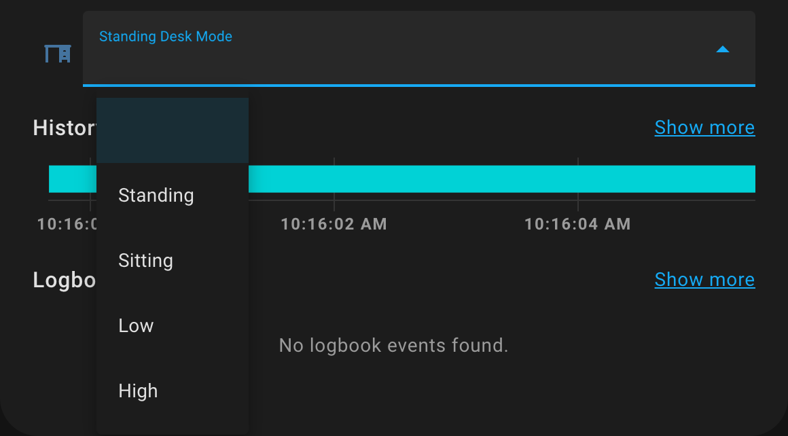

# Home Assistant

Since the firmware is based on ESPHome, Home Assistant can be integrated seamlessly with the Upsy Desky. This is the recommended way to integrate the Upsy Desky with other devices in your home, and the best way to create automations due to the wide range of integrations available for Home Assistant.

The [getting started guide](../getting-started.mdx) goes over connecting to Home Assistant.

## Community Packages

Some community members have created packages for Home Assistant that make the Upsy Desky even more useful. You can read more about Home Assistant packages and how to install them [here](https://www.home-assistant.io/docs/configuration/packages/).

### Preset Dropdown

_By `[iG] Poison#5666` on Discord_

This package exposes a helper dropdown for your desk's presets, each with its own custom name. This way, you can assign each of your presets 1-4 a human-readable name, so you don't need to remember which preset is which. It also includes some logic to detect if the desk is moving, and press the preset button twice if it is &mdash; once to stop the desk, and a second time to actually start going to the desired preset.

**Instructions:** To use, unzip into `config/packages` (an `ha-upsy-desky` folder will get created), and modify the `helpers.yaml` file with the labels you'd like.

**Download:** [ha-upsy-desky.zip](/ha-packages/ha-upsy-desky.package.zip)